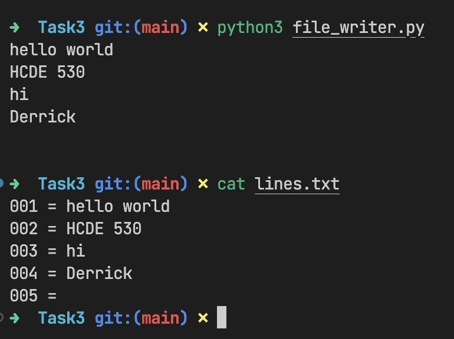
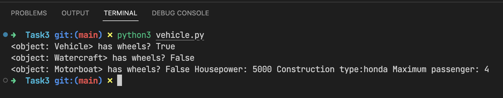

# Task 3
Code credit to Derrick Ding yingke@uw.edu
## 3.1 File Writer
Code below:
```python
# file_writer.py
import sys


class FileWriter:
    def __init__(self, filepath="./lines.txt") -> None:
        self.filepath = filepath

    def write(self, line, line_number):
        outfile = open(self.filepath, 'a')

        outfile.write(f"{line_number:03}")
        outfile.write(" = ")
        outfile.write(line)
        outfile.close()


if __name__ == "__main__":
    writer = FileWriter()

    last_is_blank = False
    line_number = 0

    for line in sys.stdin:
        line_number += 1

        if line == "\n":
            if last_is_blank:
                break
            else:
                last_is_blank = True
        
        writer.write(line, line_number)

```

Type ```python3 file_writer.py``` to run the program. The written file will be lines.txt in the same folder.

Demostration:



## 3.2 and 3.3
Code below:
```python
# vehicle.py
class Vehicle:
    def __init__(self, has_wheels) -> None:
        self.has_wheels = has_wheels

    def __repr__(self) -> str:
        return "<object: Vehicle> has wheels? " + str(self.has_wheels)


class Watercraft(Vehicle):
    def __init__(self) -> None:
        super().__init__(has_wheels=False)

    def __repr__(self) -> str:
        return "<object: Watercraft> has wheels? " + str(self.has_wheels)


class Motorboat(Watercraft):
    def __init__(self, housepower: int, construction_type: str, passengers_num: int) -> None:
        super().__init__()

        assert type(housepower) is int

        self.housepower = housepower
        self.construction_type = construction_type
        self.passengers_num = passengers_num

    def get_housepower(self):
        return self.housepower
    
    def set_housepower(self, housepower):
        self.housepower = housepower

    def __repr__(self) -> str:
        return "<object: Motorboat> has wheels? " + str(self.has_wheels) + " Housepower: " + str(self.get_housepower()) + " Construction type:" + str(self.construction_type) + " Maximum passenger: " + str(self.passengers_num)


if __name__ == "__main__":
    vehicle = Vehicle(has_wheels=True)

    watercraft = Watercraft()

    motorboat = Motorboat(housepower=5000, construction_type="honda", passengers_num=4)

    print(str(vehicle))
    print(str(watercraft))
    print(str(motorboat))

```

Type ```python3 vehicle.py``` to run the program.

Demostartion:
